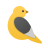

<!DOCTYPE html>
<html lang="pt-br">
<head>
    <meta charset="UTF-8">
    <meta name="viewport" content="width=device-width, initial-scale=1.0">
    <link rel="icon" href="./assets/img/passaro.png">
    <link rel="stylesheet" href="./style.css">
    <title>Flappy Bird</title>
</head>
<body class="content">
    <h1>Flappy Bird</h1>
    

        <!-- 
        

            

                

                

            

            

                

                

            

        

        
100
 -->
        <button id="botao" class="botao" onclick="clickBotao()">START</button>
    

        
</body>
</html>